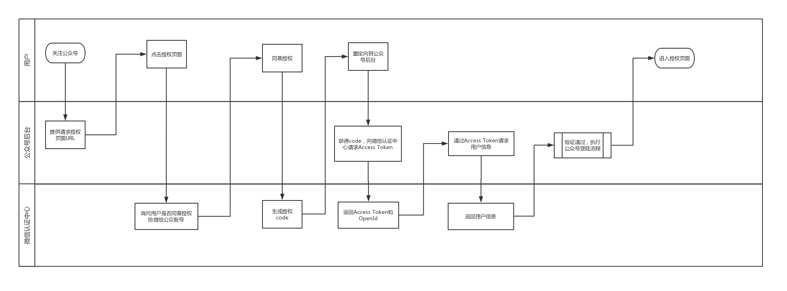
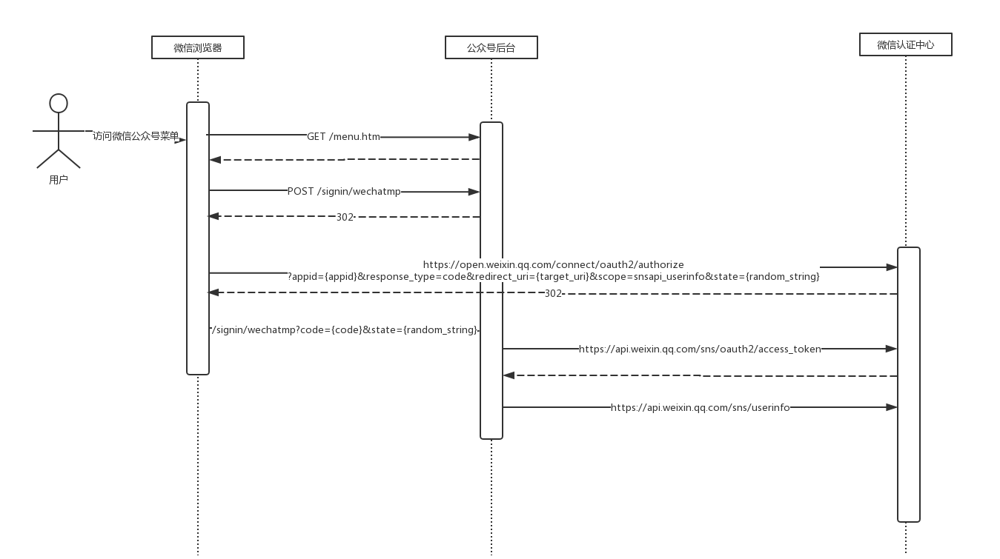

# 授权码模式
授权码模式（authorization code）是功能最完整、流程最严密的授权模式。它的特点就是通过客户端的后台服务器，与"服务提供商"的认证服务器进行互动。

- （A）用户打开客户端以后，客户端要求用户给予授权。
- （B）用户同意给予客户端授权。
- （C）客户端使用上一步获得的授权，向认证服务器申请令牌。
- （D）认证服务器对客户端进行认证以后，确认无误，同意发放令牌。
- （E）客户端使用令牌，向资源服务器申请获取资源。
- （F）资源服务器确认令牌无误，同意向客户端开放资源。

# 微信公众号登陆流程

# 微信公众号登陆序列

